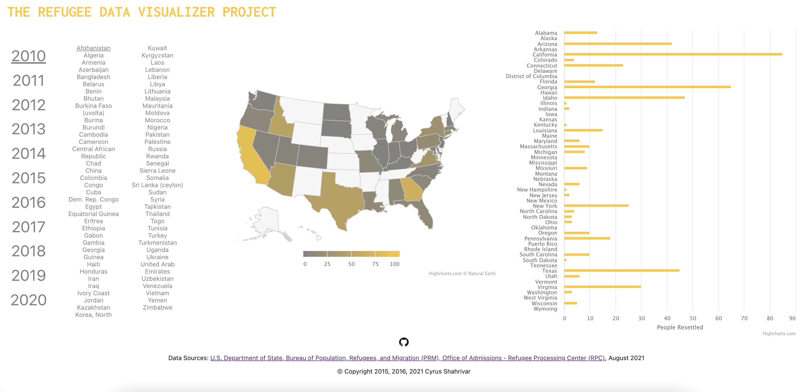

# The Refugee Data Visualizer Project

- Creator: Cyrus Shahrivar
- Version 2.0.0 (August 2021)
- https://cyrus-shahrivar.github.io/RefugeeDataVizApp/

## Purpose
This is a data visualization application that enables the public to explore refugee resettlement patterns for various groups arriving in the US for the recent past. The intent was to enable more informed dialogue in a time of heated, opinionated debate about refugees and immigration.

## Technologies Used
- React
- Highcharts: A javascript data visualization library
- HTML/CSS/Vanilla JS
- csvtojson: npm library for data format conversion from csv to json

## Build & Deploy Instructions
Run `npm run deploy`. The package.json deploy and pre-deploy scripts utilize the gh-pages npm package to deploy the site to GitHub Pages. The deployed branch is on `gh-pages`.
## Follow-On TODOs
- [ ] Add to readme
  - [X] Purpose
  - [ ] Features
  - [ ] Approach: data, coding
  - [ ] Other?
- [ ] Fix bugs with different same country / different naming
- [ ] CSS markup/naming that makes sense
- [ ] Add tests for components using RTL and regular JEST unit test where needed
- [ ] Organize and explain data usage/transformations
- [ ] Add more accessibility features
- [ ] Add printable version via print styles
- [ ] Add tutorial mode with tooltips / more interactivity
- [ ] Add social share functionality / icons
- [ ] Add continuous integration
- [ ] Possible Performance Improvements
  - [ ] Migrate data files to be served

## Why Highcharts instead of original D3 Implementation?
The original version of this applciation was written in D3.js in 2015 and 2016 and the version of D3 used at the time was version 3.0. The current version of D3.js as of this writing (2021) is version 7.0. Many things have changed in the years since. React has exploded as a preferred UI library for frontend development, which has allowed everyone to write more readable, more modular code. In keeping with moving away from managing DOM changes directly as is preferred in the React ecosystem, I chose to leverage Highcharts instead of D3.js. Highchart is a highly used data visualization library with React that abstracts any direct DOM manipulation away from my code. In addition, the sheer amount of micromanagement of D3 code makes it difficult to maintain on an ongoing basis. Highcharts allows me to write understandable, manageable code where I don't have worry as much in keeping the project maintained. I may not come back to this in several years, so I would like something that I don't have to untangle as much as the previous D3 implmenetation.

## Why use create-react-app?
I chose to leverage `create-react-app` to establish the toolchain for this project so I could bring it into present day standards without worrying about specific choices on exactly what bundler I should use, how I should configure it, etc. This makes the conversion from a static, non-modular codebase into one that is componentized and easy to build and iterate on very quickly.

## References
- [Original Project README & Documentation - 2016](./docs/original-project.md)
- [create-react-app Boilerplate Documentation](./docs/create-react-app-boilderplate.md)